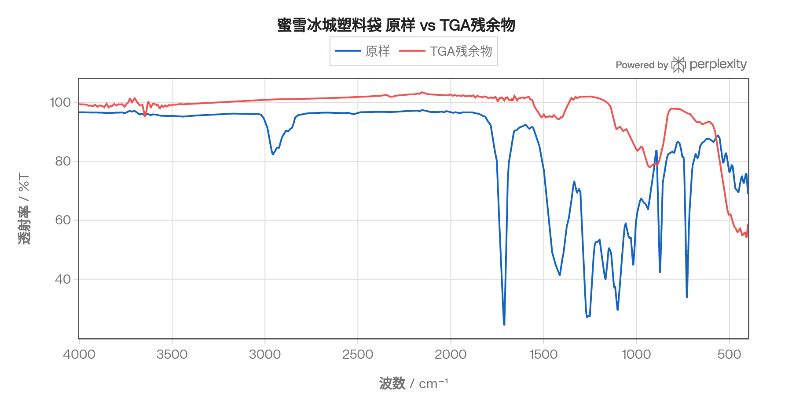
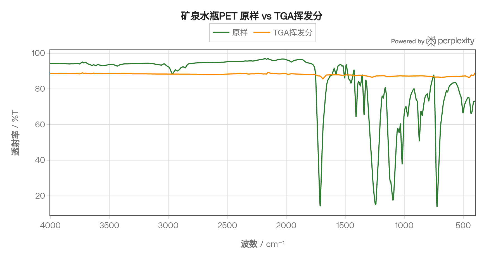
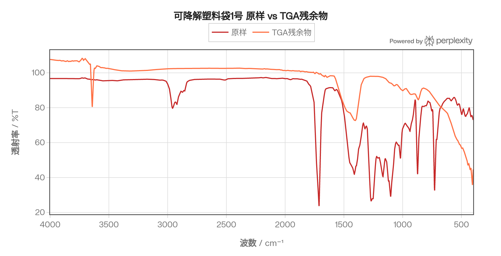
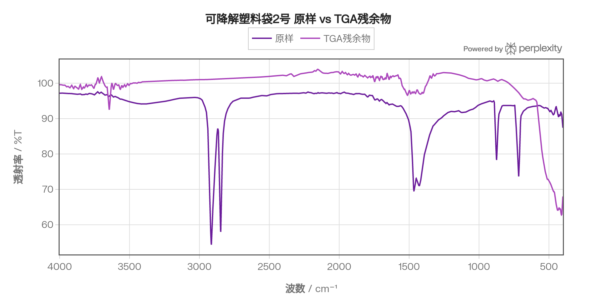

# 塑料样品红外光谱（FTIR）分析报告
## 1. 概述
本报告对四类塑料样品进行傅里叶变换红外光谱（FTIR）分析，样品包括蜜雪冰城塑料袋、矿泉水瓶PET、可降解塑料袋1号及可降解塑料袋2号。每类样品均提供**原始样品**与**热重分析（TGA）后的残余物或挥发分**两组谱图，共计8条谱线。通过比较原样与热处理后产物的特征吸收峰，可以揭示各材料的分子组成、聚合物类型及热分解行为。

所有谱图的横坐标为波数（4000–400 cm⁻¹，从左至右递减，符合FTIR标准惯例），纵坐标为透射率（%T）；吸收峰表现为谱线的极小值（透射谷）。谱图数据经Savitzky-Golay平滑处理（窗口51点，多项式3阶）以降低仪器噪声，峰位均已从原始数据中自动提取。

***
## 2. 样品信息与分组
| 编号 | 样品名称 | 配对谱图类型 | 推测主要成分 |
|------|----------|------------|------------|
| 1 | 蜜雪冰城塑料袋 | 原样 + TGA残余物 | 聚乙烯（PE） |
| 2 | 矿泉水瓶PET | 原样 + TGA挥发分 | 聚对苯二甲酸乙二酯（PET） |
| 3 | 可降解塑料袋1号 | 原样 + TGA残余物 | 含酯基聚合物（推测含PLA/PET成分） |
| 4 | 可降解塑料袋2号 | 原样 + TGA残余物 | 聚乙烯（PE）或PE共混物 |

***
## 3. 蜜雪冰城塑料袋
### 3.1 原样谱图分析

蜜雪冰城塑料袋原样的红外谱图（图1）显示典型的聚乙烯（PE）特征峰。在3000–2840 cm⁻¹区间可见亚甲基（–CH₂–）的不对称和对称C–H伸缩振动，是聚乙烯类材料最强且最具特征性的吸收带。在1466 cm⁻¹附近出现–CH₂–剪切弯曲振动，720 cm⁻¹附近的摇摆振动峰（–CH₂ rocking mode）是四个或以上亚甲基连续排列的诊断性特征峰，可用以确认PE骨架。谱图中约1377 cm⁻¹处出现甲基（–CH₃）对称弯曲峰，提示存在支链结构，表明该样品为**低密度聚乙烯（LDPE）**。此外，本样品还在1712 cm⁻¹处出现中等强度的C=O伸缩振动峰，在1266 cm⁻¹与1101 cm⁻¹处出现C–O伸缩峰，结合1413 cm⁻¹与873 cm⁻¹的峰形，推测塑料袋中含有少量酯类助剂或共混聚酯成分。

**主要特征峰归属（蜜雪冰城塑料袋原样）：**

| 峰位 (cm⁻¹) | 振动类型 | 对应基团 |
|------------|---------|---------|
| ~2916 | 不对称C–H伸缩 | –CH₂– |
| ~2848 | 对称C–H伸缩 | –CH₂– |
| ~1712 | C=O伸缩 | 酯基/添加剂 |
| ~1466 | –CH₂– 弯曲 | 亚甲基 |
| ~1377 | –CH₃ 弯曲 | 甲基支链 |
| ~1266 | C–C–O 伸缩 | 酯基 |
| ~1101 | O–C–C 伸缩 | 酯基 |
| ~720 | –CH₂– 摇摆 | 长链亚甲基序列 |
### 3.2 TGA残余物谱图分析

蜜雪冰城塑料袋经热重分析后残余物的谱图（图2）与原样相比发生显著变化，大部分PE特征峰消失，说明有机聚合物组分在高温下已基本完全热分解挥发。谱图中3645 cm⁻¹处出现较弱的O–H伸缩振动尖峰，指示残余物中可能存在游离羟基物质或少量水分吸附。408 cm⁻¹处的低波数吸收峰可能对应无机填料或碳化残留物的晶格振动。由于透射率普遍处于较高水平（~54–104%T），说明残余量少、样品厚度薄，整体信号较弱。综合来看，TGA残余物主要为无机碳化残渣或极少量无机填料。[^8][^9]

***
## 4. 矿泉水瓶PET
### 4.1 原样谱图分析

矿泉水瓶PET原样谱图（图3）呈现出芳香聚酯的标准"三峰规则"（Rule of Three）特征：**1712 cm⁻¹**处出现强烈的C=O伸缩振动（%T约14%，吸收强烈），属于芳香酯的羰基特征峰；**1243 cm⁻¹**处出现C–C–O 伸缩振动，**1095 cm⁻¹**处出现O–C–C 伸缩振动，三峰组合明确指示PET中的酯键连接。在3054 cm⁻¹附近可见苯环C–H伸缩振动，1505 cm⁻¹处出现芳香环C=C骨架振动，872 cm⁻¹附近为苯环面外C–H弯曲振动，均符合对苯二甲酸酯（terephthalate）片段的红外特征。在2969 cm⁻¹附近出现乙二醇片段的sp³ C–H 伸缩吸收，1340 cm⁻¹处的峰归属于乙二醇片段的C–H 弯曲振动。以上特征峰位置与聚对苯二甲酸乙二酯（PET）标准谱图高度吻合。

**主要特征峰归属（矿泉水瓶PET原样）：**

| 峰位 (cm⁻¹) | 振动类型 | 对应基团/结构 |
|------------|---------|------------|
| ~3054 | 芳环 C–H 伸缩 | 对苯环 |
| ~2969 | sp³ C–H 伸缩 | 乙二醇片段 |
| ~1712 | C=O 伸缩 | 芳香酯羰基 |
| ~1505 | C=C 骨架振动 | 芳香环 |
| ~1340 | C–H 弯曲 | 乙二醇片段 |
| ~1243 | C–C–O 伸缩 | 酯基 |
| ~1095 | O–C–C 伸缩 | 酯基 |
| ~872 | 芳环 C–H 面外弯曲 | 对位苯环 |
### 4.2 TGA挥发分谱图分析

矿泉水瓶PET的TGA挥发分谱图（图4）整体透射率很高（85–89%T），表明挥发分浓度极低、信号微弱，这与PET具有较高热稳定性（分解温度通常在400°C以上）以及挥发分被部分吸收或扩散损失有关。在约1689 cm⁻¹处可观察到一个弱的C=O相关吸收峰，推测与PET热裂解产生的苯甲酸（benzoic acid）、乙醛（acetaldehyde）或对苯二甲酸（terephthalic acid）等挥发性产物有关，这些小分子化合物均是PET热分解的典型气态产物。原样中所有强特征峰（1243 cm⁻¹、1095 cm⁻¹等）在挥发分谱中均消失，说明气相产物的化学结构已与固体PET截然不同。

***
## 5. 可降解塑料袋1号
### 5.1 原样谱图分析

可降解塑料袋1号的原样谱图（图5）与蜜雪冰城塑料袋的谱图具有高度相似性，均在约1711–1712 cm⁻¹处出现强的C=O伸缩峰，在1266–1267 cm⁻¹和1101–1102 cm⁻¹处出现C–O伸缩振动，在1411–1413 cm⁻¹处出现亚甲基弯曲峰，873 cm⁻¹附近有明显吸收。这一组峰型与含芳香酯或脂肪族酯的可降解聚合物一致，同时2958 cm⁻¹处的C–H 伸缩振动提示存在脂肪链。综合峰形分析，该样品极可能为**聚乳酸（PLA）与聚乙烯（PE）的共混物**，或含有酯基功能基团的改性可降解聚合物。1018 cm⁻¹处的峰与C–O单键伸缩振动对应，亦支持酯类聚合物的判断。

**主要特征峰归属（可降解塑料袋1号原样）：**

| 峰位 (cm⁻¹) | 振动类型 | 对应基团 |
|------------|---------|---------|
| ~2958 | C–H 伸缩 | 脂肪链 |
| ~1711 | C=O 伸缩 | 酯基羰基 |
| ~1411 | –CH₂– 弯曲 | 亚甲基 |
| ~1267 | C–C–O 伸缩 | 酯基 |
| ~1102 | O–C–C 伸缩 | 酯基 |
| ~1018 | C–O 伸缩 | 酯/醇基 |
| ~873 | C–H 面外弯曲 | 芳/亚乙烯基 |
### 5.2 TGA残余物谱图分析

可降解塑料袋1号TGA残余物谱图（图6）的特征与蜜雪冰城塑料袋残余物高度类似：绝大多数有机聚合物特征峰消失，原样中强烈的C=O与C–O吸收峰完全消失，说明酯类聚合物组分已发生完全热分解。3641 cm⁻¹处出现O–H伸缩振动，406 cm⁻¹处出现低波数无机吸收，1403 cm⁻¹与867 cm⁻¹处的弱峰可能与少量碳酸盐或硅酸盐类无机残余相关。残余物谱图整体信号弱（透射率高），与残留量极少相符，印证了该可降解材料优良的热分解性能。

***
## 6. 可降解塑料袋2号
### 6.1 原样谱图分析

可降解塑料袋2号原样的谱图（图7）与1号可降解塑料袋和蜜雪冰城塑料袋明显不同，呈现出**典型聚乙烯（PE）谱图特征**：2914 cm⁻¹处的–CH₂–不对称C–H伸缩峰（%T≈54.4%）和2847 cm⁻¹处的对称C–H伸缩峰构成PE的标志性强双峰；1466 cm⁻¹处为–CH₂–弯曲振动，716 cm⁻¹处为–CH₂–摇摆振动，后者出现在720 cm⁻¹附近且不见明显分裂，提示为**低密度聚乙烯（LDPE）**。值得注意的是，该谱图在1700–1800 cm⁻¹区间无明显C=O吸收，表明聚合物主链不含酯基，与1号可降解塑料袋形成鲜明对比。该塑料袋虽标注为可降解，但从红外谱图来看，其主体成分为普通PE，推测可降解性来自添加的淀粉、助氧化剂等改性添加剂（含量低，FTIR中特征峰不明显）。

**主要特征峰归属（可降解塑料袋2号原样）：**

| 峰位 (cm⁻¹) | 振动类型 | 对应基团/结构 |
|------------|---------|------------|
| ~2914 | 不对称C–H伸缩 | –CH₂–（PE主链） |
| ~2847 | 对称C–H伸缩 | –CH₂–（PE主链） |
| ~1466 | –CH₂– 弯曲 | 亚甲基 |
| ~874 | C–H 面外弯曲 | 末端基/支链 |
| ~716 | –CH₂– 摇摆 | 长链亚甲基序列 |
### 6.2 TGA残余物谱图分析

可降解塑料袋2号的TGA残余物谱图（图8）同样显示有机特征峰大幅消失，原样中2914/2847 cm⁻¹的C–H双峰和1466/716 cm⁻¹的PE特征峰均不复存在，表明聚乙烯骨架已完全热分解。残余谱图在3644 cm⁻¹处出现O–H伸缩峰，410 cm⁻¹处出现低波数吸收，与其他样品残余物规律一致。1512 cm⁻¹处出现微弱宽峰，可能指向含氮有机物残余或无机铵盐，但信号极弱（%T≈96.6%），需进一步验证。

***
## 7. 各样品横向对比
### 7.1 原样光谱对比

图9给出蜜雪冰城塑料袋原样与TGA残余物的对比谱图；图10为PET原样与挥发分对比；图11、图12分别为两种可降解塑料袋原样与残余物对比。从各原样谱图的横向比较可以归纳以下规律：

- **蜜雪冰城塑料袋**与**可降解塑料袋1号**谱形高度相似，均在1712 cm⁻¹附近有强C=O峰，提示两者主体或主要助剂成分相近（均含酯类结构），两者可能均使用了聚酯类基料或大量酯类增塑剂。
- **矿泉水瓶PET**谱图中C=O峰（1712 cm⁻¹）与C–O峰（1243、1095 cm⁻¹）均为强吸收，且苯环特征峰明确，结合"三峰规则"可无歧义地鉴定为PET。
- **可降解塑料袋2号**谱图则完全不同于前三者，仅呈现PE特征，C=O、芳环相关峰完全缺失，说明该样品为单纯PE类材料。
### 7.2 热重残余物/挥发分共性规律
四类样品的热处理后谱图均表现出以下共性：

1. **有机聚合物特征峰大量消失**，表明主体聚合物在TGA条件下完全分解，无固体残余聚合物；
2. **3640–3650 cm⁻¹处O–H峰出现或增强**，为热分解产生少量水分或残余无机组分（含羟基）的特征；
3. **低波数区（< 500 cm⁻¹）出现吸收**，指示无机矿物填料或碳化物的晶格振动；
4. PET挥发分较其他样品信号更弱，透射率基线更高，说明PET热稳定性相对最好、挥发分释放量最少。

***
## 8. 结论
| 样品 | 主体材质判断 | 鉴定依据 |
|------|------------|---------|
| 蜜雪冰城塑料袋 | LDPE（含酯类助剂） | C–H双峰、720 cm⁻¹摇摆峰、1377 cm⁻¹支链峰；叠加C=O/C–O峰（助剂） |
| 矿泉水瓶PET | PET | "三峰规则"（1712/1243/1095 cm⁻¹）+ 苯环特征峰 |
| 可降解塑料袋1号 | 含酯基可降解聚合物（推测PLA或酯类改性PE） | 与MXBC谱图高度相似，强C=O与C–O特征峰 |
| 可降解塑料袋2号 | LDPE（添加助氧化剂型可降解） | 典型PE C–H双峰 + 1466/716 cm⁻¹，无C=O峰 |

热重分析后，所有样品的有机聚合物组分均完全分解，残余物主要以无机碳化物或少量填料为主，体现了热重-红外联用分析在聚合物热分解机制研究中的重要价值。可降解塑料袋1号与蜜雪冰城塑料袋谱图高度相似，提示两者化学本质相近；而可降解塑料袋2号的PE特征表明其可降解性更多依赖物理添加剂而非化学结构改性。

