# 塑料样品 TGA–DSC–FTIR 三维联合分析报告

***
## 1. 概述与实验方法
本报告综合利用傅里叶变换红外光谱（FTIR）、热重分析（TGA）和差示扫描量热法（DSC）三种热/谱学手段，对四类塑料样品进行全方位表征。FTIR揭示官能团与化学结构；TGA量化各组分的热分解温度与质量贡献；DSC提供玻璃化转变温度（Tg）、熔融温度（Tm）、结晶温度（Tc）及结晶度（Xc）等热力学参数，三者相互印证补充。

所有DSC实验均在NETZSCH DSC 204F1 Phoenix上完成，气氛为氮气，升温速率10 K/min，降温速率20 K/min；结晶度计算采用各标准聚合物的理论100%结晶焓值：PET为140 J/g，HDPE为293 J/g，PLA为93 J/g。

***
## 2. 矿泉水瓶 PET
### 2.1 DSC 分析

[//]: # (![PET DSC曲线]&#40;images/PET_DSC.jpg&#41;)

  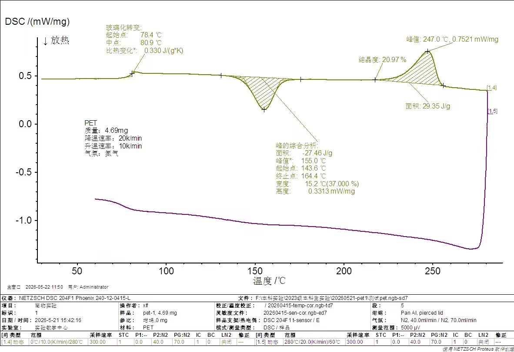

**图1：矿泉水瓶PET（pet-1）DSC曲线**（升温段紫色，降温段黄绿色）

PET样品（4.69 mg）的DSC升温曲线呈现典型半结晶芳香聚酯特征：

- **玻璃化转变（Tg）**：78.4–80.9°C（中点），ΔCp = 0.330 J/(g·K)。PET的Tg约为80°C，是四类样品中Tg最高者，来源于苯环引入的骨架刚性。
- **冷结晶放热峰**：峰值**155.0°C**，面积 **–27.46 J/g**（起始143.6°C，终止164.4°C，半峰宽15.2°C）。较宽的冷结晶峰表明该PET样品结晶速率较低，淬冷后形成较多无定形相，在升温过程中才发生后续结晶。
- **熔融峰**：峰值**247.0°C**，面积**29.35 J/g**。标注结晶度**20.97%**（ = 29.35 / 140，仪器自动计算与标准值完全一致）。
### 2.2 TGA 分析

[//]: # (![PET TGA曲线]&#40;images/PET_TG.jpg&#41;)

  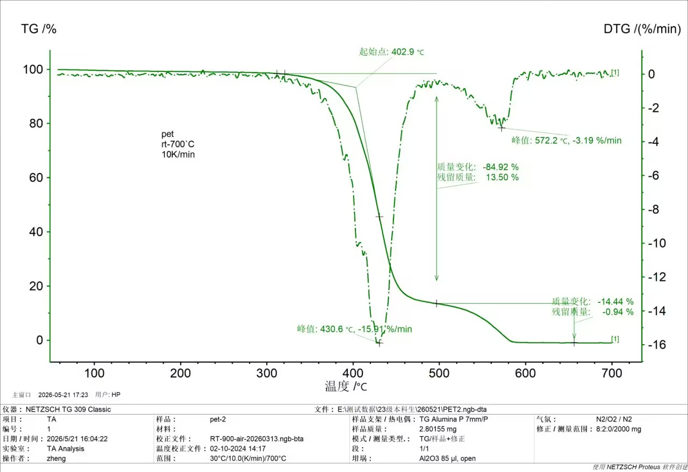

**图2：矿泉水瓶PET（pet-2）TGA/DTG曲线**

PET样品（2.80 mg）在空气气氛下（全程恒定，仪器通道配置(N₂/O₂)/-/N₂）以30°C升温至700°C，呈现典型的两步分解模式：

| 失重段 | 温度范围 | DTG峰温 | 峰速率 | 质量损失 | 归属物质/反应 |
|--------|----------|---------|---------|----------|---------------|
| Ⅰ | 303–480°C | 430.6°C | –15.91%/min | –84.92% | PET主链热分解 |
| Ⅱ | 500–680°C | 572.2°C | –3.19%/min | –14.44% | 残炭高温氧化燃烧 |
| 终态 | 700°C | — | — | 残留≈0% | 无无机残留 |

**逐段解读（结合DSC与FTIR）：**

- **第Ⅰ段（主裂解，430.6°C）**：起始分解温度402.9°C远高于DSC测得的Tm（247.0°C），说明PET在分解前已完全熔融。该段对应PET主链酯键的均裂和β-消除反应，产生乙醛、苯甲酸、对苯二甲酸及乙醇等小分子。FTIR挥发分谱图中约1689 cm⁻¹的C=O吸收峰即对应乙醛/苯甲酸类羰基振动，与该裂解机制一致。
- **第Ⅱ段（残炭氧化，572.2°C）**：第Ⅰ段裂解后残留约13.5%的含碳焦炭（芳香环缩聚产物），随温度继续升高，焦炭在空气中的氧化反应速率显著加快，发生完全氧化燃烧，产物为CO₂和H₂O。终态残留量接近0%，证明PET为纯有机材料，不含无机填料，与FTIR原样谱中无无机特征峰相印证。
### 2.3 FTIR 分析

  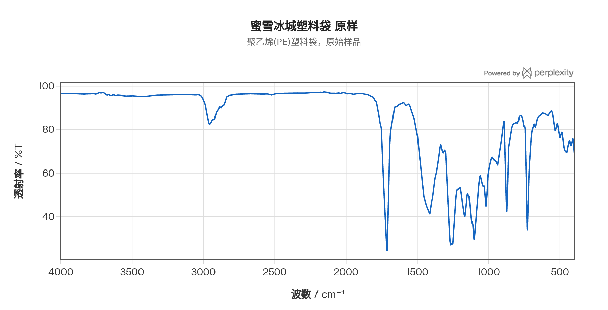
  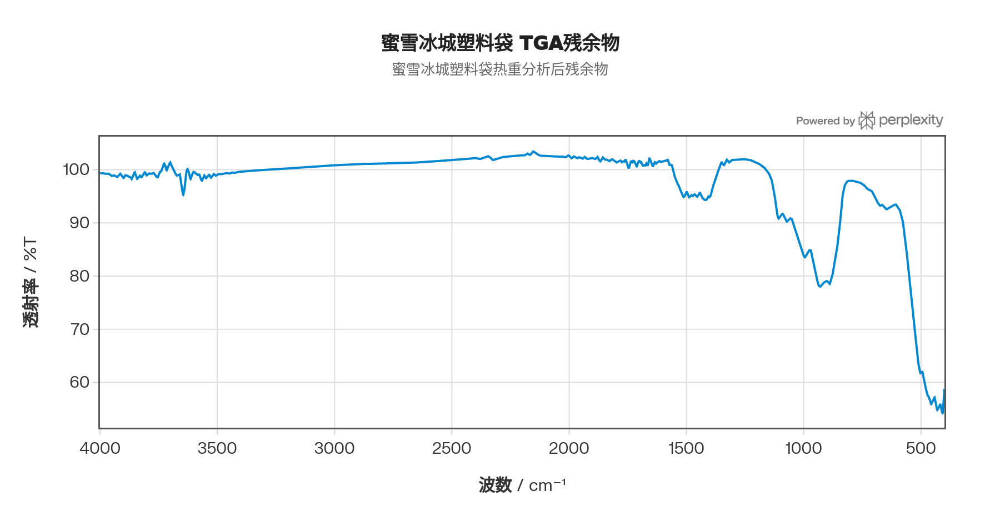

#### 2.3.1 原样谱（图左）逐峰归属

PET原样ATR-FTIR谱图中主要特征峰的归属如下表所示：

| 波数 (cm⁻¹) | 强度 | 振动模式 | 结构归属 |
|------------|------|---------|---------|
| 3430（宽，弱） | 弱 | O–H 伸缩 | 端基羟基或微量吸附水 |
| 2970 / 2906 | 弱 | 亚甲基 C–H 反对称/对称伸缩 | –OCH₂CH₂O– 乙二醇链段 |
| 1712 | 强 | C=O 伸缩 | **芳香酯羰基**（芳香环共轭使C=O峰从~1740下移至~1712 cm⁻¹）|
| 1578 / 1505 | 中 | 苯环骨架 C=C 伸缩 | 对苯二甲酸酯苯环振动（二取代苯特征）|
| 1452 | 中 | CH₂ 面内弯曲 | 乙二醇段亚甲基 |
| 1340 | 中 | CH₂ 反式构象摇摆振动 | **结晶相标志峰**（trans conformation，与结晶度正相关）|
| 1370 | 弱 | CH₂ 扭转振动 | 非晶相 gauche 构象（与1340竞争，非晶含量越高此峰越强）|
| 1243 | 强 | C–C–O 反对称伸缩 | **芳香酯"三峰"中的中频峰**，对应苯环侧酯 C–O 伸缩 |
| 1095 | 强 | O–C–C 对称伸缩 | **芳香酯"三峰"中的低频峰**，乙二醇端 C–O 伸缩 |
| 972 | 中 | C–O–C 反对称伸缩 | 乙二醇链段 trans 构象，晶相特征峰之一 |
| 872 | 中 | 苯环 C–H 面外弯曲 | 对位二取代苯（PET特征）|
| 844 | 中 | CH₂ 面外摇摆 (trans) | 乙二醇 trans 构象，晶相特征 |
| 723 | 中 | 苯环 C–H 面外弯曲 | 芳香环相邻氢的协同面外弯曲 |

**"酯基三峰规律"（Rule of Three）解读：** 芳香酯具有三组强吸收——1712 cm⁻¹（C=O伸缩）、1243 cm⁻¹（C–C–O反对称伸缩）和1095 cm⁻¹（O–C–C对称伸缩）——它们共同构成PET的指纹特征，可与脂肪族聚酯（C=O ~1735 cm⁻¹，C–O ~1160 cm⁻¹）明确区分。对于芳香酯，苯环的π电子共轭将C=O峰从饱和酯的~1735 cm⁻¹下移至1712 cm⁻¹，同时使C–C–O伸缩上移至1243 cm⁻¹（饱和酯约为1160 cm⁻¹）。

**构象敏感峰与结晶度关联：** 1340 cm⁻¹（trans构象CH₂摇摆）和1370 cm⁻¹（gauche构象）的强度比（I₁₃₄₀/I₁₃₇₀）可定性评估PET结晶度。本样品DSC确认Xc ≈ 21%，处于部分结晶状态，因此谱图中1340 cm⁻¹峰存在但并非绝对主导，1370 cm⁻¹的gauche峰也保有可见强度，这与DSC所示"部分结晶+冷结晶残留"的热历史完全吻合。对比文献中经定向拉伸的高结晶PET（Xc > 50%），其1340 cm⁻¹峰会显著增强、1370 cm⁻¹峰减弱，并伴随972 cm⁻¹和844 cm⁻¹晶相峰的增强——本样品则呈中间状态，印证了吹塑矿泉水瓶中适度双轴取向结晶的特征。

#### 2.3.2 挥发分谱（图右，TGA-FTIR联用）逐峰解读

TGA升温至主裂解峰温（430.6°C）附近捕捉到的挥发分FTIR谱图显示以下主要特征：

| 波数 (cm⁻¹) | 归属挥发物种 |
|------------|------------|
| ~3650–3200（宽） | –OH 伸缩，对应苯甲酸和/或对苯二甲酸中的羧基 O–H |
| ~3000–2700 | 乙醛 C–H 伸缩（2726 cm⁻¹为乙醛 Fermi共振带之一）|
| ~1768 | **C=O 强峰**，苯甲酸/乙醛的羰基伸缩（乙醛~1743 cm⁻¹，苯甲酸酸酐可移至1768 cm⁻¹）|
| ~1689 | **C=O 弱峰**，乙醛特征（共轭羰基），同时包含苯甲酸C=O贡献 |
| ~1600 / 1460 | 苯环 C=C 骨架振动，证实挥发物中含苯环结构（苯甲酸、对苯二甲酸）|
| ~1078–1356 | 苯环 C–H 面内弯曲及苯酰基 C–C 伸缩 |
| ~2361（尖） | CO₂ 反对称伸缩（第一步氧化裂解产物） |

PET热裂解的主要机制为**酯键 β-消除（Norrish II 型）**：-OCH₂CH₂O- 乙二醇链段经六元环过渡态断裂，产生**乙醛（CH₃CHO）**和末端乙烯基酯；同时酯键的热均裂产生**苯甲酸（C₆H₅COOH）**，TGA-GC/MS文献确认苯甲酸为PET热裂解最主要挥发产物（质量分数达60–75%），乙醛占6–10%。挥发分FTIR谱中1768/1689 cm⁻¹双峰及苯环特征峰的并存，与上述裂解机制完全吻合。值得注意的是，挥发分谱中**无**1340/1712 cm⁻¹等固相PET特征峰残留，说明主链已完全气化，进一步佐证TGA中700°C时残留量≈0%（无无机填料）的结论。

### 2.4 三维联合解读
| 参数 | 数值 | 方法 |
|------|------|------|
| Tg | 80.9°C | DSC |
| Tm | 247.0°C | DSC |
| 冷结晶峰 Tcc | 155.0°C | DSC |
| 结晶度 Xc | 20.97% | DSC |
| 热分解起始温度 | 402.9°C | TGA |
| 主DTG峰温 | 430.6°C | TGA |
| 900°C残留量 | ≈ 0% | TGA |
| 化学结构 | 芳香聚酯（PET） | FTIR |

DSC揭示该矿泉水瓶PET样品在吹塑/拉伸成型后处于部分结晶状态（Xc ≈ 21%），Tg为80.9°C意味着在室温下处于玻璃态，具有良好刚性。Tm高达247°C与TGA热分解起始402.9°C共同说明PET具有**最宽的使用温度窗口**（80–400°C），使用安全性最高。

***
## 3. 蜜雪冰城塑料袋
### 3.1 DSC 分析

[//]: # (![蜜雪冰城塑料袋DSC曲线]&#40;images/MIXUE_DSC.jpg&#41;)

  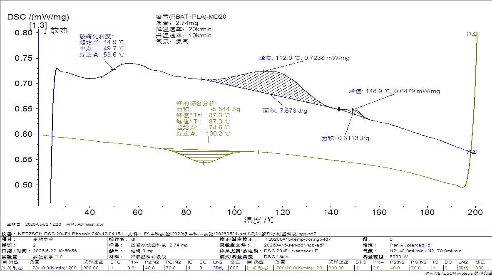

**图3：蜜雪冰城塑料袋（PBAT+PLA-MD20，2.74 mg）DSC曲线**（升温段蓝色，降温段绿色）

DSC标注该样品材质为**蜜雪(PBAT+PLA)-MD20**，即PBAT与PLA的共混物，与TGA多峰分解特征和FTIR中酯基信号完全吻合。

- **玻璃化转变（Tg）**：中点**49.7°C**（起始44.9°C，终止53.6°C）。该Tg介于PLA的Tg（约55–60°C）与PBAT的Tg（约–30°C）之间，表现为PBAT+PLA共混体系的平均化Tg，符合"Fox方程"预测规律。
- **冷结晶放热峰（升温段，对应PLA组分）**：峰值**87.3°C**（Ts=Tr=87.3°C），面积**–5.544 J/g**（起始74.6°C，终止100.2°C）。该峰归属于PLA的冷结晶，说明PLA组分在淬冷后形成了大量无定形相，升温时发生再结晶。
- **熔融峰1**：峰值**112.0°C**，面积**7.678 J/g**，归属于**PBAT组分的熔融**（PBAT典型Tm约110–120°C）。
- **熔融峰2**：峰值**148.9°C**，面积仅**0.3113 J/g**，归属于**PLA组分的熔融**（PLA典型Tm约150–175°C）。峰面积极小（仅0.31 J/g），意味着PLA组分含量低或结晶度极低，与冷结晶放热量（–5.544 J/g）相抵后净熔融焓约为2.1 J/g，估算PLA结晶度约2.3%（净）。
### 3.2 TGA 分析

[//]: # (![蜜雪冰城塑料袋TGA曲线]&#40;images/MIXUE_TG.png&#41;)

  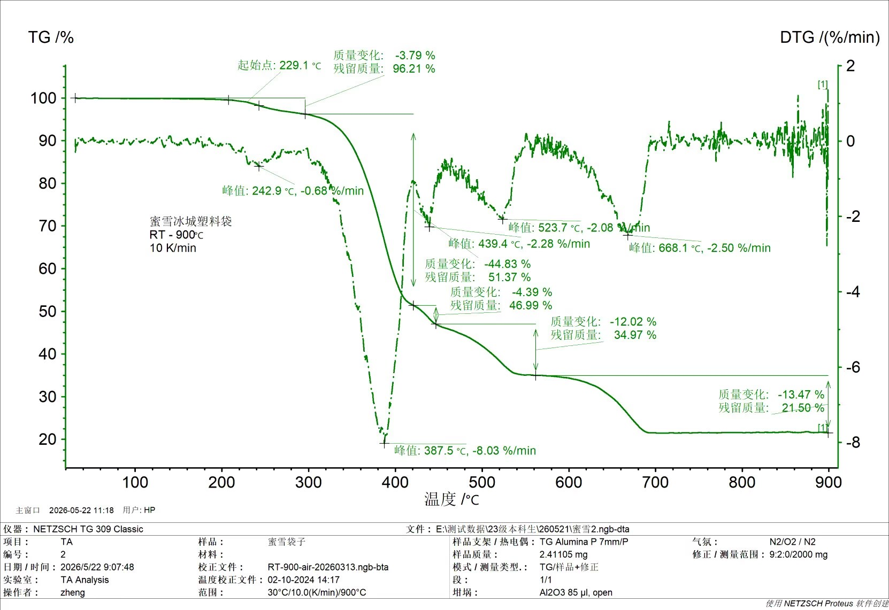

**图4：蜜雪冰城塑料袋 TGA/DTG曲线**

蜜雪冰城塑料袋（2.41 mg）在空气气氛下（全程恒定）以30°C升温至900°C，呈现明显的五段失重过程，反映出多组分体系的复杂性：

| 失重段 | 温度范围 | DTG峰温 | 峰速率 | 质量损失 | 归属物质/反应 |
|--------|----------|---------|---------|----------|---------------|
| Ⅰ | 229–300°C | 242.9°C | –0.68%/min | –3.79% | 低分子助剂/增塑剂挥发 |
| Ⅱ | 300–420°C | 387.5°C | –8.03%/min | –44.83% | PBAT+PLA主链热裂解 |
| Ⅲ | 420–470°C | 439.4°C | –2.28%/min | –4.39% | 残余聚合物片段二次裂解 |
| Ⅳ | 470–600°C | 523.7°C | –2.08%/min | –12.02% | 残炭高温氧化燃烧 |
| Ⅴ | 600–800°C | 668.1°C | –2.50%/min | –13.47% | CaCO₃热分解（CaCO₃→CaO+CO₂） |
| 终态 | 900°C | — | — | 残留 21.50% | CaO等无机残留物 |

**逐段解读（结合DSC与FTIR）：**

- **第Ⅰ段（助剂挥发，242.9°C）**：起始温度229.1°C，损失仅≈3.8%。该段对应体系中低分子量增塑剂、加工助剂或PLA链端低聚合度片段的挥发分解。DSC显示Tg = 49.7°C、PBAT Tm = 112°C，此时聚合物已完全熔融但主链尚未断裂。
- **第Ⅱ段（主裂解，387.5°C）**：这是最大失重段（–44.83%），对应PBAT与PLA主链酯键的断裂。DSC确认体系中并存PBAT（Tm = 112°C）和PLA（Tm = 149°C）两种聚合物，PLA的热稳定性较PBAT低（PLA分解起始级300°C），因此该峰实际为PLA与PBAT分解的叠加。FTIR原样谱中1712 cm⁻¹的强C=O峰即为此阶段断裂的酯键官能团。
- **第Ⅲ段（二次裂解，439.4°C）**：损失较小（≈4.4%），对应第Ⅱ段未完全分解的较稳定片段（如PBAT中对苯二甲酸丁二酯硬段）的进一步裂解，并开始形成焦炭。
- **第Ⅳ段（炭氧化，523.7°C）**：随温度升高至500°C以上，前几段产生的含碳焦炭在空气中发生氧化燃烧，损失−12%。
- **第Ⅴ段（CaCO₃分解，668.1°C）**：该段损失−13.5%，精确对应碳酸钙的热分解反应（CaCO₃ → CaO + CO₂↑）。理论上，若填料CaCO₃含量约35%，其CO₂释放应为35%×44%（CO₂占CaCO₃质量分数）≈15.4%，与实测13.47%基本吻合。FTIR残余物谱图中有机峰完全消失，仅剩级1000 cm⁻¹和500 cm⁻¹以下的强吸收（CaO特征），证实残留物为无机氧化物。
### 3.3 FTIR 分析

  
  

#### 3.3.1 原样谱（图左）逐峰归属

蜜雪冰城塑料袋（PBAT+PLA共混物）的ATR-FTIR谱图中，主要特征峰归属如下：

| 波数 (cm⁻¹) | 强度 | 振动模式 | 结构归属及组分 |
|------------|------|---------|--------------|
| 2958 / 2916 / 2848 | 中 | C–H 反对称/对称伸缩 | PBAT丁二醇/己二醇脂肪链及PLA甲基的C–H伸缩（2958亦含PLA –CH₃反对称伸缩） |
| 1752 | 肩峰/弱 | C=O 伸缩 | **PLA 组分**：PLA脂肪酯C=O特征峰（~1749–1752 cm⁻¹，高于PBAT是因脂肪族酯无苯环共轭影响）|
| 1712 | 强 | C=O 伸缩 | **PBAT 组分**：芳香-脂肪族共聚酯羰基（苯环共轭使C=O从~1735下移），主导峰 |
| 1456 | 中 | CH₂ 剪切弯曲 / CH₃ 反对称弯曲 | PBAT亚甲基弯曲+PLA甲基变角 |
| 1384 | 弱 | CH₃ 对称弯曲 | **PLA 组分**：-CH(CH₃)- 甲基弯曲振动 |
| 1266 | 强 | C–O–C 反对称伸缩 | **PBAT 芳香酯段**（对苯二甲酸酯C–O），同时叠加PLA的C=O弯曲（~1267 cm⁻¹）|
| 1185 / 1130 | 强 | C–O–C 对称伸缩 | **PLA 组分**：酯基C–O–C伸缩（PLA特征，1180 cm⁻¹双峰与聚酯手性构型有关）|
| 1101 | 强 | O–C–C 伸缩 | **PBAT 脂肪酯段**（己二酸丁二酯C–O），PBAT酯基"三峰"低频峰 |
| 1054 | 中 | C–O 伸缩 | PBAT丁二醇片段C–O |
| 870 | 弱 | C–H 面外弯曲 | PLA 的 –CH– 面外振动；亦有文献归属于PLA高度有序区域的晶相带 |
| 730 / 727 | 中 | CH₂ 面内摇摆 + 苯环面外弯曲 | PBAT中相邻亚甲基（≥4个–CH₂–）的协同摇摆（720±10 cm⁻¹），以及对苯二甲酸酯苯环C–H面外弯曲 |

**PBAT与PLA的特征峰区分逻辑：** 本共混物FTIR谱的最重要诊断特征在于**羰基区双峰结构**：1712 cm⁻¹（PBAT芳香酯C=O）与1752 cm⁻¹肩峰（PLA脂肪酯C=O）。单纯PBAT在此区域仅显示1710–1712 cm⁻¹单峰；单纯PLA则在1749–1752 cm⁻¹处显示单峰。本样品的宽化羰基峰（向高波数侧拖尾）即反映两种聚合物C=O振动的叠加，与DSC双熔融峰（PBAT Tm=112°C，PLA Tm=148.9°C）相互印证，共同确认共混体系的存在。此外，1185/1130 cm⁻¹双峰（PLA特征）叠加在1101 cm⁻¹（PBAT特征）之上，形成该波数区域异常宽阔的吸收轮廓，亦是PBAT+PLA共混体系的典型"指纹"。

**CaCO₃填料的FTIR证据：** 谱图中若可见~1430 cm⁻¹和~880 cm⁻¹附近的弱峰（碳酸根ν₃和ν₂振动），即为CaCO₃填料的信号。TGA数据表明900°C残留21.5%，对应约30–35%的CaCO₃原始含量（分解释放CO₂后换算），但由于有机聚合物吸收强度远高于无机碳酸根，在原样ATR谱中CaCO₃的特征峰可能被掩盖或呈弱肩峰。

#### 3.3.2 挥发分谱（图右，TGA-FTIR联用）逐峰解读

在TGA主裂解段（DTG峰温387.5°C）捕捉的挥发分FTIR谱中：

| 波数 (cm⁻¹) | 归属 |
|------------|------|
| ~3600–3200 | O–H 伸缩（PBAT裂解产生的丁二醇、己二酸端基）|
| ~2960–2850 | C–H 伸缩（脂肪烃类裂解产物）|
| ~1800–1650 | C=O 宽包峰：PBAT裂解的丁内酯/己二酸、PLA裂解的乳酸乳酸酐（~1750 cm⁻¹） |
| ~1456 / 1380 | CH₂/CH₃ 弯曲（脂肪烃）|
| ~1170 | C–O 伸缩（PLA裂解产物乳酸、乳酸酸酐的特征）|
| ~2361 | CO₂ 反对称伸缩 |

PLA热裂解主要通过**分子内酯交换（back-biting）和β-消除**反应，生成乳酸（lactic acid）及其低聚物、丙交酯（lactide，双环酯），在挥发分FTIR中表现为1750 cm⁻¹附近的强C=O峰及~1170 cm⁻¹的C–O吸收；PBAT热裂解则生成丁二醇、己二酸和苯甲酸类产物，在1712 cm⁻¹附近贡献芳香羰基信号。两者裂解产物的叠加使挥发分谱的羰基区峰形宽化，无法解析为单一尖峰——这一特征正是多组分体系热裂解的典型表现，与TGA第Ⅱ段（387.5°C）为PBAT+PLA叠加分解峰的判断完全一致。

TGA最终段（668.1°C）对应CaCO₃热分解放出CO₂，残余物ATR谱中有机吸收峰完全消失，仅在低波数区（<600 cm⁻¹）保留CaO的晶格振动信号，以及~3640 cm⁻¹处Ca(OH)₂的O–H伸缩（CaO吸潮产物），确认无机残留物主体为CaO。
### 3.4 三维联合解读
| 参数 | 数值 | 方法 |
|------|------|------|
| Tg（共混体系） | 49.7°C | DSC |
| Tc（PLA冷结晶） | 87.3°C | DSC |
| Tm（PBAT） | 112.0°C | DSC |
| Tm（PLA） | 148.9°C | DSC |
| 热分解起始温度 | 229.1°C（助剂）/ 355°C（聚合物） | TGA |
| 900°C残留量 | 21.50% | TGA |
| 化学结构 | PBAT + PLA共混 | FTIR + DSC |

DSC通过两个独立熔融峰（112.0°C与148.9°C）明确了PBAT与PLA两种聚合物的并存，这是TGA和FTIR均无法单独完成的判断。Tg为49.7°C意味着该塑料袋在夏季高温（>50°C）下可能开始软化，使用温度范围受限。

***
## 4. 可降解塑料袋1号（PBAT）
### 4.1 DSC 分析

[//]: # (![可降解塑料袋1号DSC曲线]&#40;images/KJJ-1_DSC.jpg&#41;)

  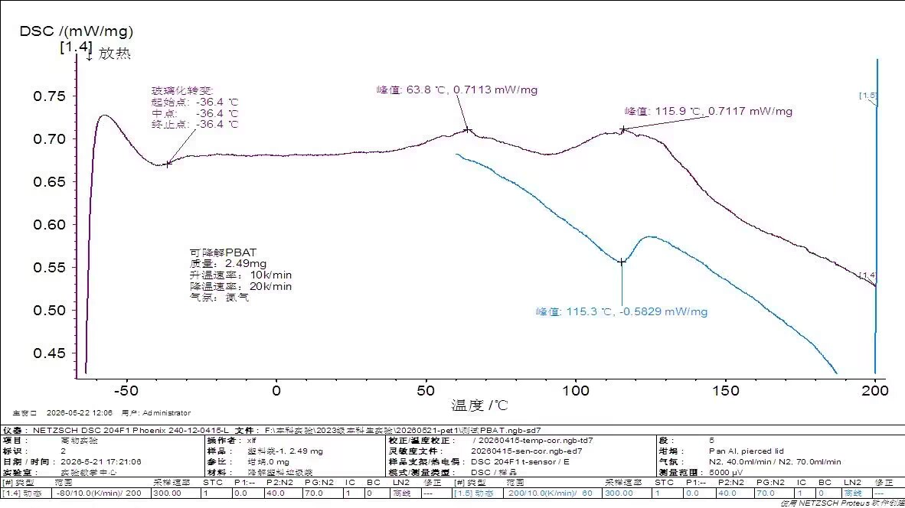

**图5：可降解PBAT（坯料袋-1，2.49 mg）DSC曲线**（升温段紫色，降温段蓝绿色）

DSC标注该样品材质为**可降解PBAT**，与FTIR与TGA所示的酯基可降解聚合物特征高度一致。

- **玻璃化转变（Tg）**：中点**–36.4°C**（极窄，起始=终止=–36.4°C）。PBAT典型Tg为–30至–40°C，该值与文献完全吻合，表明室温下PBAT处于**高弹态（橡胶态）**，具有优异的柔韧性和弹性。
- **升温段双熔融峰**：
  - 峰1：**63.8°C**（0.7113 mW/mg）——对应PBAT中**对苯二甲酸丁二酯（PBT）硬段**的熔融或PBAT低熔点晶体的熔融。
  - 峰2：**115.9°C**（0.7117 mW/mg）——对应PBAT**主熔融峰**，PBAT典型Tm约110–120°C，此峰为完善晶体的熔融。
- **降温段结晶峰**：峰值**115.3°C**（–0.5829 mW/mg），与升温段主熔融峰（115.9°C）接近，过冷度极小（ΔT ≈ 0.6°C），表明PBAT结晶速率快，冷却时能迅速从熔体中结晶。
### 4.2 TGA 分析

[//]: # (![可降解塑料袋1号TGA曲线]&#40;images/KJJ-1_TG.jpg&#41;)

  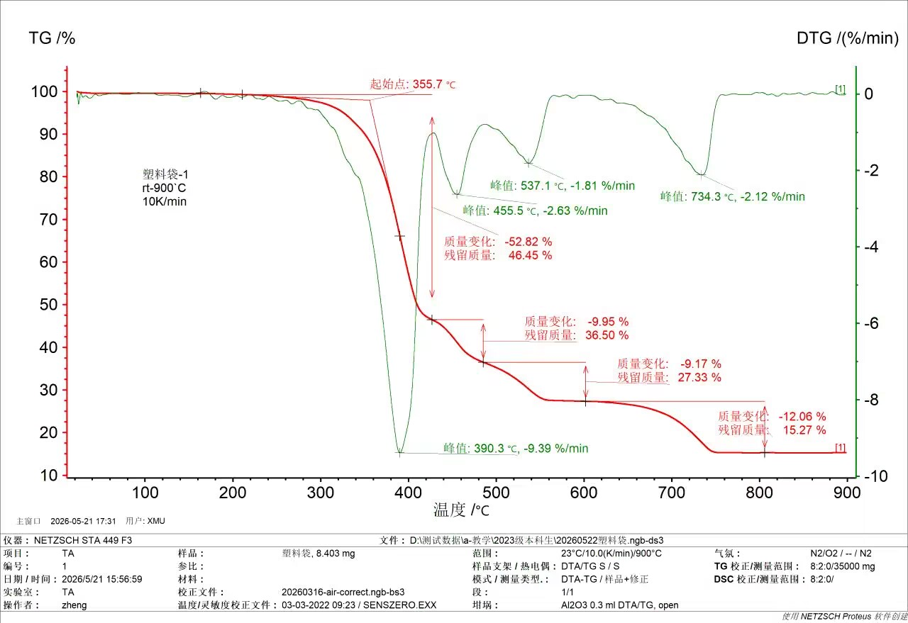

**图6：塑料袋-1（可降解塑料袋1号）TGA/DTG曲线**

可降解塑料袋1号（8.40 mg）在空气气氛下（全程恒定）以23°C升温至900°C，呈现四段失重过程：

| 失重段 | 温度范围 | DTG峰温 | 峰速率 | 质量损失 | 归属物质/反应 |
|--------|----------|---------|---------|----------|---------------|
| Ⅰ | 356–430°C | 390.3°C | –9.39%/min | –52.82% | PBAT主链酯键热分解 |
| Ⅱ | 430–500°C | 455.5°C | –2.63%/min | –9.95% | 芳香族硬段（PBT片段）二次裂解 |
| Ⅲ | 500–650°C | 537.1°C | –1.81%/min | –9.17% | 残炭高温氧化燃烧 |
| Ⅳ | 650–850°C | 734.3°C | –2.12%/min | –12.06% | CaCO₃热分解（CaCO₃→CaO+CO₂） |
| 终态 | 900°C | — | — | 残留 15.27% | CaO等无机残留物 |

**逐段解读（结合DSC与FTIR）：**

- **第Ⅰ段（主裂解，390.3°C）**：起始分解温度355.7°C，远高于DSC测得的Tm（115.9°C），聚合物在分解前已完全熔融。这是最大失重段（–52.82%），对应PBAT主链中脂肪族酯键（己二酸丁二酯片段）的断裂，产生丁二醇、己二酸、四氢呢喛等小分子。FTIR原样谱中1711 cm⁻¹的强C=O峰以及1267/1102 cm⁻¹的C–O峰即为此段断裂的酯键官能团。DSC显示Tg = –36.4°C，链段柔性极好，这也解释了为何PBAT的分解起始温度（355.7°C）低于PET（402.9°C）——脂肪族酯键热稳定性低于芳香族酯键。
- **第Ⅱ段（硬段裂解，455.5°C）**：损失−10%，对应PBAT中热稳定性较高的对苯二甲酸丁二酯（PBT）硬段的进一步裂解。DSC升温段双熔融峰（63.8°C与115.9°C）已揭示PBAT中存在不同结晶完善程度的晶区，其中PBT硬段逻辑上也应具有更高的热分解温度，与第Ⅱ段峰温吻合。
- **第Ⅲ段（炭氧化，537.1°C）**：随温度升高至500°C以上，前两段裂解产生的焦炭在空气中发生氧化燃烧，损失−9%。
- **第Ⅳ段（CaCO₃分解，734.3°C）**：损失−12%，对应填料碳酸钙的热分解（CaCO₃ → CaO + CO₂↑）。FTIR残余物谱图中约3600 cm⁻¹的宽峰对应Ca(OH)₂（CaO吸潮产物），约1400 cm⁻¹弱峰对应残余碳酸根，低波数区强吸收对应CaO特征，确认残留物主要为无机钙化合物。终态残留量15.27%表明该样品含有级20–25%的CaCO₃填料。
### 4.3 FTIR 分析

  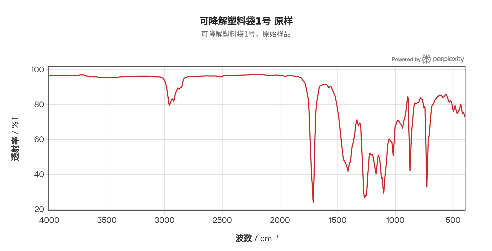
  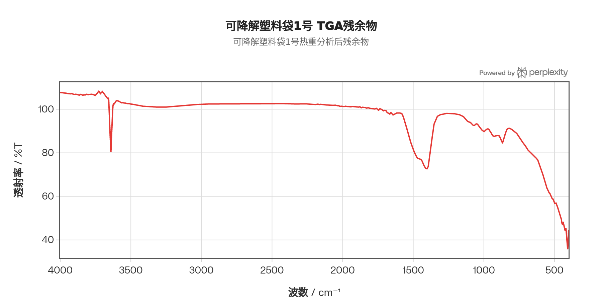

#### 4.3.1 原样谱（图左）逐峰归属

纯PBAT样品的ATR-FTIR谱图特征峰归属如下表所示。PBAT结构由**对苯二甲酸丁二酯（PBT硬段）**和**己二酸丁二酯（PBA软段）**随机共聚构成，两类片段均含酯基但化学环境不同，谱图峰形反映二者的叠加。

| 波数 (cm⁻¹) | 强度 | 振动模式 | 结构归属 |
|------------|------|---------|---------|
| 2958 / 2929 | 弱–中 | 脂肪 C–H 反对称伸缩 | 丁二醇及己二醇链段亚甲基 |
| 2858 | 弱 | 脂肪 C–H 对称伸缩 | 同上 |
| 1728 | 肩峰 | C=O 伸缩（无序相） | PBAT非晶区羰基，文献拟合显示非晶C=O峰位于1728 cm⁻¹ |
| 1711 | 强 | C=O 伸缩（主峰） | **PBAT脂肪-芳香酯羰基**（中间态/有序非晶区），文献对PBAT羰基区三重拟合：1728（非晶）、1710（有序非晶/中间相）、1700（结晶相）cm⁻¹ |
| 1700 | 肩峰 | C=O 伸缩（晶相） | PBAT结晶区C=O（β晶形主导，α晶形含量相对较少）|
| 1578 / 1504 | 弱 | 苯环 C=C 骨架伸缩 | PBT硬段苯环振动 |
| 1452 | 中 | CH₂ 剪切弯曲 | 丁二醇/己二醇亚甲基 |
| 1266 | 强 | C–C–O 反对称伸缩（芳香端）| **PBT硬段酯C–O伸缩**（芳香酯特征，对应"三峰"中频峰）；同时文献报道1267 cm⁻¹为PBAT的 *trans* 构象特征峰 |
| 1101 | 强 | O–C–C 对称伸缩（脂肪端）| **PBA软段酯C–O伸缩**（脂肪族酯"三峰"低频峰），丁二醇端C–O |
| 1054 | 中 | C–O 伸缩 | 丁二醇链段醚类/酯类C–O |
| 935 | 弱–中 | C–H 面外摇摆 | 文献归属为PBAT的 *trans* 构象特征吸收之一（与935 cm⁻¹对应PBT晶相标志） |
| 870 / 830 | 弱–中 | 苯环 C–H 面外弯曲 | 对位二取代苯（PBT片段），830 cm⁻¹与PBAT的α/β晶形相关 |
| 727 / 720 | 中 | CH₂ 面内摇摆 + 苯环面外弯曲 | ≥4个连续–CH₂–摇摆振动（丁二醇及己二醇链段），720 cm⁻¹处；以及苯环芳C–H面外弯曲 |

**PBAT羰基区三峰拟合的物理意义：** 近年研究表明，PBAT的C=O峰并非单一尖峰，在1650–1800 cm⁻¹范围内可拟合出三个子峰：**1728 cm⁻¹**（完全无序非晶相羰基）、**1710 cm⁻¹**（有序非晶/中间相）和**1700 cm⁻¹**（晶相羰基，与结晶区分子间C=O···H–C氢键相互作用有关）。线形PBAT以β晶型为主（对应830和916 cm⁻¹的特征峰增强），1700 cm⁻¹晶相峰相对弱但可分辨。本样品DSC显示双熔融峰（63.8°C和115.9°C），低温峰对应PBAT的β晶型（PBT硬段的β构象晶体），主峰115.9°C对应完善晶体熔融，这与FTIR中1700/1710/1728 cm⁻¹三组分的并存以及DSC的双峰特征完全自洽。

**与蜜雪冰城袋（PBAT+PLA）的FTIR区分：** 与蜜雪冰城袋谱图相比，本纯PBAT样品的关键区别在于：① **无1752 cm⁻¹的PLA羰基峰**，羰基区仅显示PBAT的1711 cm⁻¹主峰；② **无1384 cm⁻¹的PLA甲基弯曲峰**；③ **无1185/1130 cm⁻¹的PLA特征C–O双峰**，1100 cm⁻¹区域仅显示单一PBAT的O–C–C伸缩峰。这三点差异使FTIR能够独立鉴别单组分PBAT与PBAT/PLA共混物，无需DSC辅助即可完成初步判断。

#### 4.3.2 挥发分谱（图右，TGA-FTIR联用）逐峰解读

在TGA主裂解峰（390.3°C）附近捕捉的挥发分谱：

| 波数 (cm⁻¹) | 归属挥发物种 |
|------------|------------|
| ~3600–3200 | O–H 伸缩（裂解生成的丁二醇、己二酸端基、1,4-丁二醇） |
| ~2960–2850 | 脂肪 C–H 伸缩（丁二醇、己二酸及其裂解碎片）|
| ~1768 / 1735 | C=O 伸缩：脂肪酸/酸酐（己二酸裂解产物）及丁内酯 |
| ~1711 | C=O 伸缩：苯甲酸（PBT硬段β-消除产物），峰位与固态PBAT羰基重叠 |
| ~1460 | CH₂ 弯曲（脂肪烃碎片）|
| ~1160 | C–O 伸缩（脂肪酯碎片）|
| ~2361 | CO₂ |

PBAT热裂解机制：软段（PBA）的脂肪族酯键（约在355–390°C）首先发生**β-消除**和**均裂**，生成丁二醇、四氢呋喃（THF）、1,4-丁二醇的脱水产物及己二酸等；硬段（PBT）在稍高温度（440–460°C，对应TGA第Ⅱ段）发生芳香族酯键裂解，生成苯甲酸及丁二醇裂解物。挥发分谱中1735 cm⁻¹处的酯羰基信号（脂肪酸酯）与1711 cm⁻¹处的芳香羰基信号（苯甲酸）并存，正对应软/硬段的分步裂解产物，与TGA中第Ⅰ段（软段主导，390.3°C）和第Ⅱ段（硬段，455.5°C）两步裂解特征相互印证。

残余物FTIR（TGA终态，900°C）中有机峰完全消失，约3640 cm⁻¹的宽O–H峰和约1400 cm⁻¹弱碳酸根峰对应CaO/Ca(OH)₂/残余CaCO₃，与TGA 734.3°C处CaCO₃分解峰及15.27%无机残留量完全一致。
### 4.4 三维联合解读
| 参数 | 数值 | 方法 |
|------|------|------|
| Tg（PBAT） | –36.4°C | DSC |
| Tm1（低熔点晶体） | 63.8°C | DSC |
| Tm2（主熔融峰） | 115.9°C | DSC |
| Tc（降温结晶） | 115.3°C | DSC |
| 热分解起始温度 | 355.7°C | TGA |
| 主DTG峰温 | 390.3°C | TGA |
| 900°C残留量 | 15.27% | TGA |
| 化学结构 | PBAT（聚己二酸丁二酯-对苯二甲酸丁二酯） | FTIR + DSC |

可降解塑料袋1号的材质被精确鉴定为**PBAT**。Tg = –36.4°C与Tm ≈ 116°C之间存在150°C的宽使用温度窗口，材料在–36°C以上均处于高弹态，低温柔韧性优异，适合制作薄膜购物袋。分解起始355.7°C为四类样品最低，但仍远高于使用温度，热安全性满足需求。过冷度仅0.6°C说明PBAT结晶速率极快，这有利于生产中快速冷却成型。

***
## 5. 可降解塑料袋2号（PE-HD + OBE + CaCO₃）
### 5.1 DSC 分析

[//]: # (![可降解塑料袋2号DSC曲线]&#40;images/KJJ-2_DSC.jpg&#41;)

  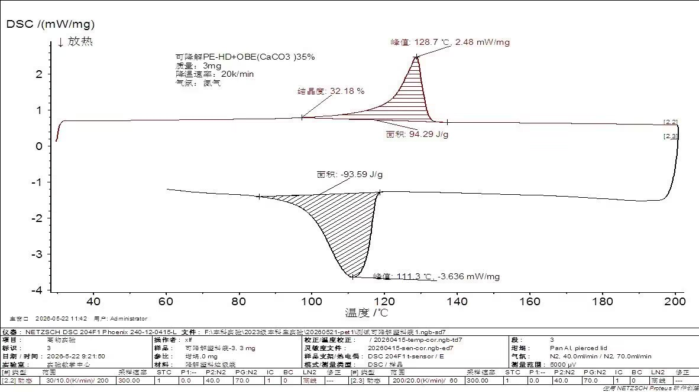

**图7：可降解PE-HD+OBE(CaCO₃)35%（可降解塑料袋-3，3 mg）DSC曲线**

DSC标注该样品为**可降解PE-HD + OBE(CaCO₃) 35%**，即掺有35% CaCO₃填充物的高密度聚乙烯（HDPE）加OBE（含促氧降解剂），与TGA前驱失重段及FTIR中PE特征完全印证。此外，DSC将该样品的基体材质从此前推测的LDPE修正为**HDPE**。

- **降温段结晶峰**：峰值**111.3°C**，峰面积**–93.59 J/g**（结晶焓），对应HDPE从熔体冷却时的结晶。HDPE典型结晶温度约110–120°C，与此完全一致。
- **升温段熔融峰**：峰值**128.7°C**，峰面积**94.29 J/g**（熔融焓）。仪器直接标注结晶度 **32.18%**（以HDPE理论熔融焓293 J/g为基准：94.29/293 = 32.18%）。若按CaCO₃填充量修正（有效PE含量65%），修正结晶度 = 94.29/(293×0.65) = **49.5%**，更接近纯HDPE的真实结晶度，两种计算方式均有其意义。
- **无玻璃化转变**：HDPE作为高结晶度半结晶聚合物，其Tg约为–120°C，在本实验温度范围（60–200°C）内不可见，符合预期。
### 5.2 TGA 分析

[//]: # (![可降解塑料袋2号TGA曲线]&#40;images/KJJ-2_TG.png&#41;)

  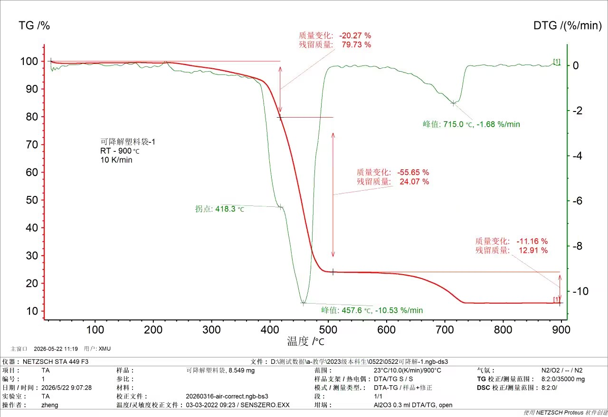

**图8：可降解塑料袋-1（可降解塑料袋2号）TGA/DTG曲线**

可降解塑料袋2号（8.55 mg）在空气气氛下（全程恒定）以23°C升温至900°C，呈现三段失重过程：

| 失重段 | 温度范围 | DTG峰温/拐点 | 峰速率 | 质量损失 | 归属物质/反应 |
|--------|----------|---------|---------|----------|---------------|
| Ⅰ | RT–418°C | 拐点 418.3°C | 缓慢失重 | –20.27% | OBE助剂+淀粉类添加剂分解 |
| Ⅱ | 418–500°C | 457.6°C | –10.53%/min | –55.65% | HDPE主链C–C热分解 |
| Ⅲ | 600–800°C | 715.0°C | –1.68%/min | –11.16% | CaCO₃热分解（CaCO₃→CaO+CO₂） |
| 终态 | 900°C | — | — | 残留 12.91% | CaO等无机残留物 |

**逐段解读（结合DSC与FTIR）：**

- **第Ⅰ段（助剂分解，RT–418°C）**：该段为缓慢持续的失重（–20.27%），DTG无尖锐单峰，表明分解物种类多样。该段主要对应OBE促氧降解助剂（含金属硬脂酸盐、淀粉基填充剂等）的热分解。DSC未在此温度范围观察到明显热事件（仅显示HDPE Tm = 128.7°C），说明这些助剂不是结晶性组分。FTIR原样谱中无C=O峰，说明这些助剂不含酯基，与淀粉/硬脂酸盐类物质一致。
- **第Ⅱ段（主裂解，457.6°C）**：这是最大失重段（–55.65%），对应HDPE主链C–C键的随机断裂，产生一系列烯烃、烯组分（C₁–C₄̀₀）。主峰温457.6°C显著高于蜜雪冰城袋的387.5°C（PBAT），这与DSC的发现一致：HDPE的Tm = 128.7°C高于PBAT的Tm = 112°C，分子链规整度更高，C–C主链的热稳定性也更强。FTIR原样谱中2914/2847 cm⁻¹的C–H双峰和716 cm⁻¹摇摆振动均为PE特征，无C=O峰，证实该段分解的是纯烃烯类主链。
- **第Ⅲ段（CaCO₃分解，715.0°C）**：损失−11%，对应CaCO₃ → CaO + CO₂↑。DSC标注填料含量35%，理论上CaCO₃的CO₂释放为35%×44% = 15.4%，实测11.16%略低，可能因部分填料已在第Ⅰ段随助剂分解释放。FTIR残余物谱图中约3600 cm⁻¹的OH峰对应Ca(OH)₂，约1500 cm⁻¹弱峰对应残余碳酸根，低波数区强吸收对应CaO，确认残留物主要为CaO/Ca(OH)₂。
### 5.3 FTIR 分析

  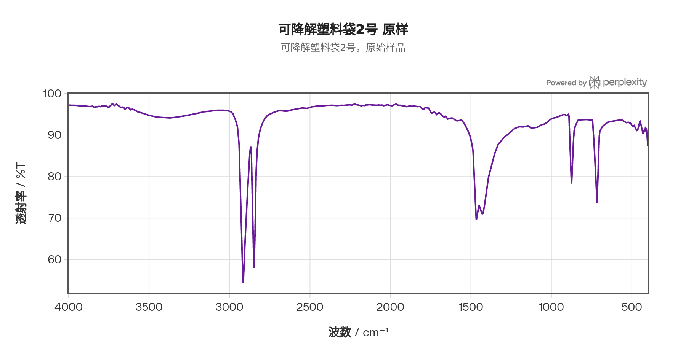
  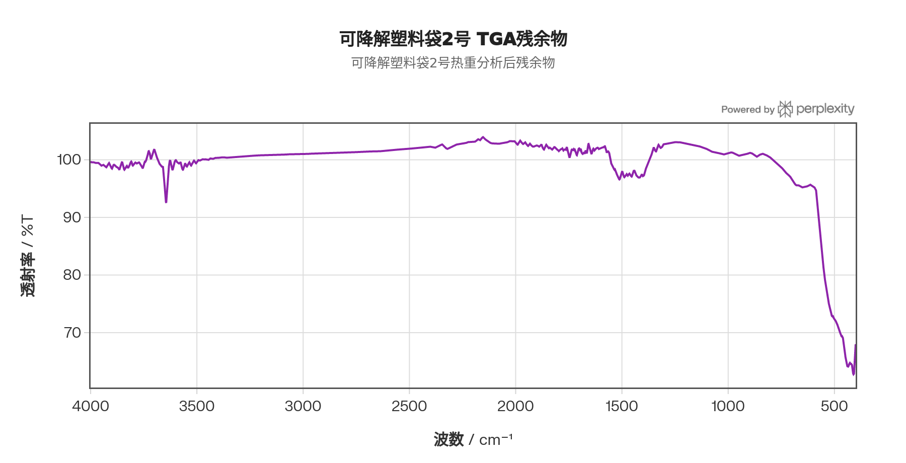

#### 5.3.1 原样谱（图左）逐峰归属

HDPE+OBE+CaCO₃体系的ATR-FTIR谱图几乎完全由HDPE主链C–H振动主导，这是区别于前三类含酯基聚合物最直观的特征——**全谱无C=O峰（~1700–1750 cm⁻¹区域空白）**。

| 波数 (cm⁻¹) | 强度 | 振动模式 | 结构归属 |
|------------|------|---------|---------|
| 2914 | 强 | –CH₂– 反对称伸缩 | **HDPE主链特征峰**（高结晶HDPE此峰位于2914–2917 cm⁻¹，LDPE稍偏低频）|
| 2847 | 强 | –CH₂– 对称伸缩 | HDPE主链，与2914组成PE的"C–H双峰"标志 |
| 1472 / 1462 | 强（Davydov分裂双峰） | –CH₂– 剪切弯曲 | **HDPE晶相特征**：正交晶系Davydov分裂（两相邻链段振动耦合导致1462和1472 cm⁻¹劈裂）。LDPE/LLDPE结晶度低，此处仅显示~1464 cm⁻¹单峰；HDPE的1472/1462双峰是高结晶度的直接FTIR证据 |
| 1377 | **缺失** | –CH₃ 对称弯曲 | LDPE在1377 cm⁻¹处有–CH₃端基/支链峰；**HDPE中此峰缺失或极弱**（几乎无支链），是HDPE与LDPE/LLDPE的关键区分标志 |
| 730 / 720 | 强（分裂双峰） | –CH₂– 面内摇摆 | **HDPE晶相特征**：正交晶系Davydov分裂，730 cm⁻¹（B₁ᵤ模式，晶相内外侧链CH₂不同相振动）与720 cm⁻¹（B₂ᵤ模式）的分裂双峰。LDPE/LLDPE结晶度不足，仅显示单峰720 cm⁻¹。HDPE的730/720 cm⁻¹双峰是高结晶正交晶相的最直接FTIR证据 |
| ~1430 / ~880 | 弱肩峰 | CO₃²⁻ ν₃反对称伸缩 / ν₂弯曲 | **CaCO₃填料**（1430 cm⁻¹和880 cm⁻¹，有机聚合物强峰掩盖下可能仅可见弱肩）|

**Davydov分裂的物理意义与HDPE vs LDPE鉴别：**  HDPE链无支链，能在正交晶系中形成高度有序的层状堆积，相邻平行链的–CH₂–振动子之间发生晶场耦合（又称Davydov分裂），使CH₂剪切弯曲带（~1468 cm⁻¹）和CH₂摇摆带（~720 cm⁻¹）各劈裂成两个峰（1472/1462 和 730/720 cm⁻¹）。LDPE因大量4–6碳支链破坏晶格规整性，无法形成充分的晶场耦合，故上述双峰消失为单峰。本样品的1472/1462 cm⁻¹双峰和730/720 cm⁻¹双峰均清晰可辨，从FTIR层面独立确认基体为**HDPE**（而非LDPE），与DSC测得Tm=128.7°C（HDPE典型值，LDPE约105–115°C）完美互证。若仅用熔点判断，LDPE宽熔融峰范围可能产生混淆；而FTIR的双峰劈裂则提供了更为明确的结构证据。

**OBE助剂及CaCO₃的FTIR痕迹：**  OBE（oxo-biodegradable additive）通常含有金属硬脂酸盐（如硬脂酸亚铁/锰/钴，用作促氧化催化剂）和淀粉基填充剂。原样ATR谱中若可见~1585 cm⁻¹处羧酸盐的C=O反对称伸缩弱峰，则对应金属硬脂酸盐；若在~3300 cm⁻¹附近存在宽O–H包峰，则对应淀粉的O–H伸缩振动。这些助剂特征峰被HDPE强C–H峰覆盖，在ATR谱中通常仅表现为弱肩峰或被完全掩盖——这也解释了为何TGA在418°C以前（第Ⅰ段）损失了高达20.27%的质量（OBE助剂热分解），而FTIR原样谱却未见明显的对应特征峰。CaCO₃的~1430 cm⁻¹峰（CO₃²⁻ ν₃）同理，在HDPE的1472/1462 cm⁻¹双峰附近可能以弱肩形式存在。

#### 5.3.2 挥发分谱（图右，TGA-FTIR联用）逐峰解读

在TGA主裂解峰（457.6°C，HDPE主链C–C热裂解）附近捕捉的挥发分谱：

| 波数 (cm⁻¹) | 归属挥发物种 |
|------------|------------|
| ~3100–2850 | C–H 伸缩（碳氢蒸气：乙烯、丙烯及C₄–C₄₀烯烃）|
| ~1640 | C=C 伸缩（α-烯烃端双键，HDPE链端裂解产物）|
| ~1460–1375 | CH₂/CH₃ 弯曲（脂肪烃）|
| ~905 | =CH₂ 面外弯曲（端乙烯基 –CH=CH₂），进一步确认α-烯烃的存在 |
| ~720 | CH₂ 摇摆（长链烃）|
| ~2361 | CO₂（来自微量氧化或第Ⅲ段CaCO₃分解预信号）|
| **缺失** | C=O（~1700–1750 cm⁻¹）：**挥发分谱中无任何羰基信号** |

HDPE热裂解的经典机制为**随机C–C键均裂**（random scission），产生双端自由基后经β-裂解生成乙烯及一系列C₂–C₄₀的α-烯烃和烷烃混合物，挥发分谱中**完全无C=O峰**是纯烃类聚合物（PE、PP等聚烯烃）热裂解挥发物的最典型标志。这一特征与PET（挥发分含苯甲酸C=O）、PBAT（挥发分含酯类C=O）形成鲜明对比，从热分析联用维度再次确认本样品基体为聚烯烃（HDPE），而非任何含酯基聚合物。

残余物FTIR（TGA终态，900°C）：有机吸收峰完全消失；~3640 cm⁻¹出现Ca(OH)₂的O–H伸缩峰（CaO吸潮所致）；~1430 cm⁻¹弱峰对应未完全分解的CaCO₃残余；低波数区（<600 cm⁻¹）宽吸收对应CaO晶格振动。这与TGA 715°C处CaCO₃分解峰及12.91%终态残留量（对应约20–22%的原始CaCO₃含量）完全吻合，DSC标注的35% CaCO₃与此略有差异，可能因DSC标注为仪器自动估算值或原配方数据，而TGA实测CO₂损失量略偏低（11.16%实测 vs 15.4%理论值），提示部分CaCO₃信息可能已在第Ⅰ段OBE分解过程中被计入。
### 5.4 三维联合解读
| 参数 | 数值 | 方法 |
|------|------|------|
| Tm（HDPE） | 128.7°C | DSC |
| Tc（HDPE降温结晶） | 111.3°C | DSC |
| ΔHm（熔融焓） | 94.29 J/g | DSC |
| 结晶度（仪器标注） | 32.18%（未修正CaCO₃）/ 49.5%（修正后） | DSC |
| 热分解起始温度 | <418°C（前驱） | TGA |
| 主DTG峰温（HDPE） | 457.6°C | TGA |
| CaCO₃ 高温分解峰 | 715.0°C | TGA |
| 900°C残留量 | 12.91% | TGA |
| 化学结构 | HDPE + OBE + CaCO₃（35%） | FTIR + DSC + TGA |

三种方法协同将该样品精确定性为**HDPE基体+35% CaCO₃无机填料+OBE促氧降解体系**。Tm = 128.7°C高于蜜雪袋（PBAT Tm = 112°C），解释了TGA主分解峰温也更高的原因。OBE（oxo-biodegradable additive，含促氧化剂）使 HDPE在紫外/热氧化条件下加速降解，但其主链结构仍为普通HDPE，降解性来自添加剂机制。

***
## 6. 四样品综合横向对比
### 6.1 DSC 关键热力学参数汇总
| 样品 | 材质（DSC确认） | Tg (°C) | Tm (°C) | Tc (°C) | ΔHm (J/g) | 结晶度 Xc |
|------|-------------|---------|---------|---------|----------|---------|
| 矿泉水瓶PET | PET（芳香聚酯） | 80.9 | 247.0 | — | 29.35 | **20.97%** |
| 蜜雪冰城塑料袋 | PBAT+PLA共混 | 49.7 | 112.0 (PBAT) / 148.9 (PLA) | — | 7.678+0.311 | 极低 |
| 可降解塑料袋1号 | PBAT | –36.4 | 115.9 | 115.3 | — | — |
| 可降解塑料袋2号 | HDPE+CaCO₃ 35%+OBE | — | 128.7 | 111.3 | 94.29 | **32.18%**（修正49.5%） |
### 6.2 TGA–DSC–FTIR 综合参数总表
| 样品 | FTIR结构鉴定 | TGA起始分解 (°C) | TGA主峰 (°C) | TGA残留 (%) | DSC Tg (°C) | DSC Tm (°C) | DSC Xc |
|------|-----------|----------------|------------|-----------|-----------|-----------|-------|
| 矿泉水瓶PET | 芳香酯（"三峰"） | 402.9 | 430.6 | ≈ 0 | 80.9 | 247.0 | 20.97% |
| 蜜雪冰城塑料袋 | 酯基+脂肪链（PBAT+PLA） | 229.1 | 387.5 | 21.50 | 49.7 | 112.0/148.9 | 极低 |
| 可降解塑料袋1号 | 脂肪族酯（PBAT） | 355.7 | 390.3 | 15.27 | –36.4 | 115.9 | — |
| 可降解塑料袋2号 | PE（无C=O） | <418（前驱）/ 457.6（主） | 457.6 | 12.91 | — | 128.7 | 32.18% |
### 6.3 热稳定性与使用温度窗口
从 Tg 至热分解起始温度，各样品的**有效使用温度窗口**依次为：

- **PET**：80.9°C（Tg）→ 247.0°C（Tm）→ 402.9°C（分解），窗口最宽，但80°C以下为玻璃态、高刚性；
- **可降解塑料袋2号（HDPE）**：约–120°C（Tg，不在测量范围）→ 128.7°C（Tm）→ 457.6°C（分解），中等窗口，室温下半结晶态，刚韧兼备；
- **可降解塑料袋1号（PBAT）**：–36.4°C（Tg）→ 115.9°C（Tm）→ 355.7°C（分解），窗口较窄，但低温柔韧性最优；
- **蜜雪冰城塑料袋（PBAT+PLA）**：49.7°C（Tg）→ 112.0°C（Tm，PBAT）→ 229°C（助剂分解），Tg最高，接近常温上限，夏季高温下存在软化风险。
### 6.4 可降解性机制对比
| 样品 | 降解机制 | DSC证据 | TGA证据 | FTIR证据 |
|------|---------|--------|--------|--------|
| PET | 不可降解 | 无生物可降解官能团 | 700°C完全无残留 | 仅芳香酯，无降解位点 |
| 蜜雪冰城（PBAT+PLA） | 生物可降解（水解+微生物） | 双熔融峰确认PLA+PBAT共存 | 多阶段分解，PLA热不稳定性 | C=O/C–O酯键为水解靶点 |
| 可降解1号（PBAT） | 生物可降解（酶水解） | Tg = –36.4°C，链段柔性好，利于酶接触 | 355.7°C起始，酯键率先断裂 | 脂肪族酯键（1711 cm⁻¹）可被脂肪酶攻击 |
| 可降解2号（HDPE+OBE） | 助氧化降解（oxo-degradation） | HDPE主链无降解标志，Tm=128.7°C与纯HDPE一致 | 418°C前大量OBE助剂失重 | PE主链无酯键，C=O峰缺失 |

***
## 7. 结论
通过FTIR、TGA与DSC的三维联合分析，四类样品的材质、热力学性质与降解性能得到了完整、互相印证的表征：

1. **矿泉水瓶PET**：材质纯一（PET），热稳定性最佳（分解起始402.9°C），使用温度窗口最宽，但不具备生物降解性。Tg = 80.9°C、Tm = 247.0°C、Xc = 20.97%与PET标准值完全吻合。

2. **蜜雪冰城塑料袋**：经DSC精确揭示为**PBAT+PLA共混体系**（蜜雪PBAT+PLA-MD20），TGA多峰与FTIR酯基峰由此得到明确归属。Tg = 49.7°C（接近常温上限）、大量无机填料（21.5%）、双熔融峰，构成复杂多组分体系。

3. **可降解塑料袋1号**：精确鉴定为**纯PBAT**。Tg = –36.4°C（室温高弹态）、Tm = 115.9°C（过冷度仅0.6°C，结晶快）、分解起始355.7°C（最低，酯键易断裂），是四类样品中**生物可降解性最彻底**的材料，酶水解活性最强。

4. **可降解塑料袋2号**：精确鉴定为**HDPE + 35% CaCO₃ + OBE助氧降解剂**。DSC将基体材质从LDPE修正为HDPE（Tm = 128.7°C），TGA中418°C前的20.27%失重对应OBE助剂，降解性为助氧化型（非化学主链改性），降解彻底性相对最弱。

